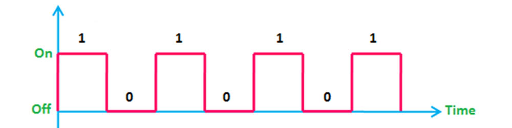

# Микропроцессорные системы
> [!NOTE]
> Здесь находятся проекты, связанные с программированием Arduino Uno[^2]

<hr>

## Генерация звука

В простейшем случае генерация звука подразумевает генерацию "квадратного" сигнала. Т.е., на выход, к которому подключен пьезоизлучатель (или другое устройство воспроизведения звука), на протяжении t единиц времени подается напряжение, t ед. - нет.



Пример кода, генерирующего квадратный сигнал: 
```
void setup() {
  pinMode(LED_BUILTIN, OUTPUT);
}

void loop() {
  // turn the LED on (HIGH is the voltage level)
  digitalWrite(LED_BUILTIN, HIGH);   
  // wait for a second
  delay(1000);

  // turn the LED off by making the voltage LOW
  digitalWrite(LED_BUILTIN, LOW);
  // wait for a second
  delay(1000);
}
```

Для того, чтобы сгенерировать сигнал частотой 50 Гц, необходимо в течение 10 мс подавать напряжение (логическую единицу) на выход, и 10 мс напряжение на выход не подавать.

Т.е. период сигнала: 

$T=1000ms/freq=1000ms/{50}=20ms$

Тогда продолжительность воспроизведения сигнала и задержки:

$duration=T/2$

> В реализации простейшего синтезатора используется встроенная функция tone(pin, freq, duration?), позволяющая генерировать тон с заданной частотой, на протяжении определенного количества времени. Документация доступна [тут](https://www.arduino.cc/reference/en/language/functions/advanced-io/tone/)

[^1]: [Форматирование Markdown Github](https://docs.github.com/en/get-started/writing-on-github/getting-started-with-writing-and-formatting-on-github/basic-writing-and-formatting-syntax).

[^2]: Материалы по программированию Arduino [тут](https://all-arduino.ru/programmirovanie-arduino/).
  Описание Arduino Uno можно найти [здесь](http://wiki.amperka.ru/products:arduino-uno)